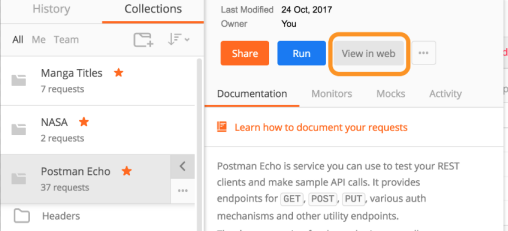
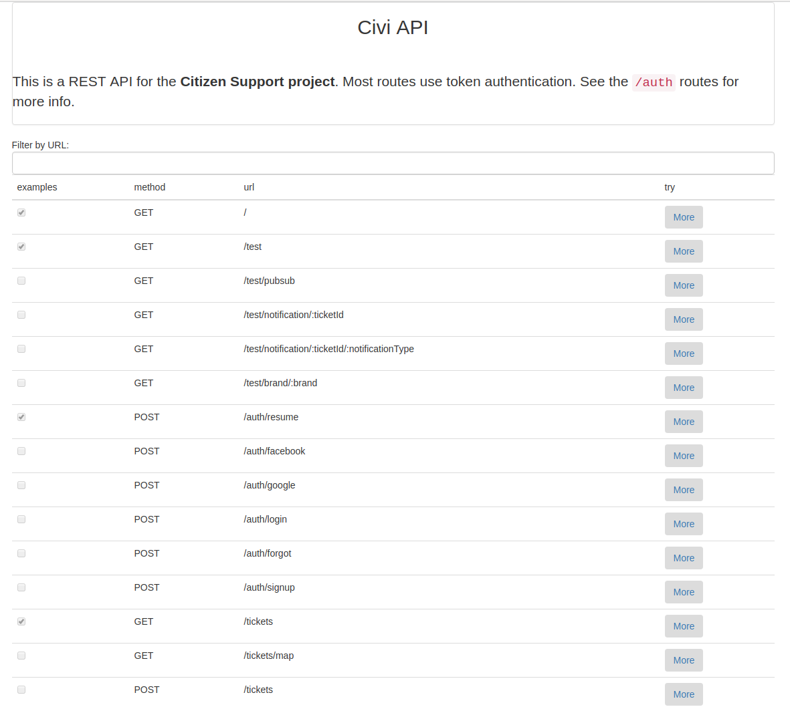
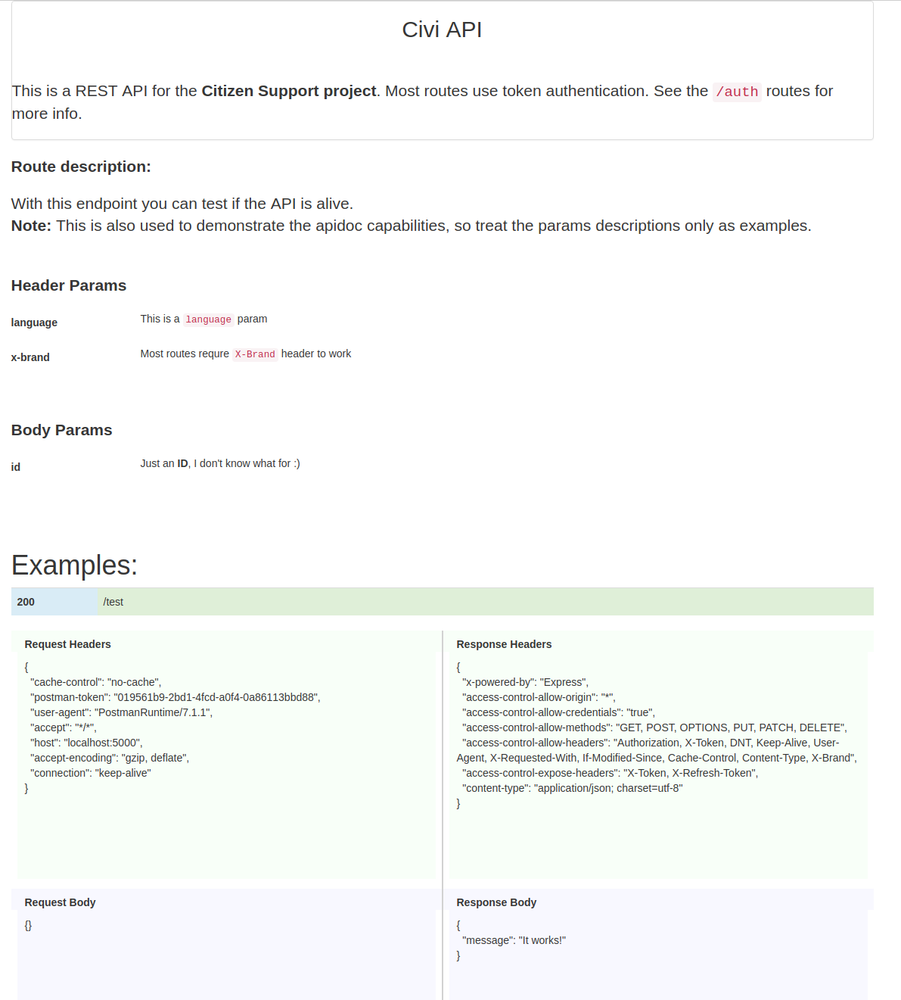
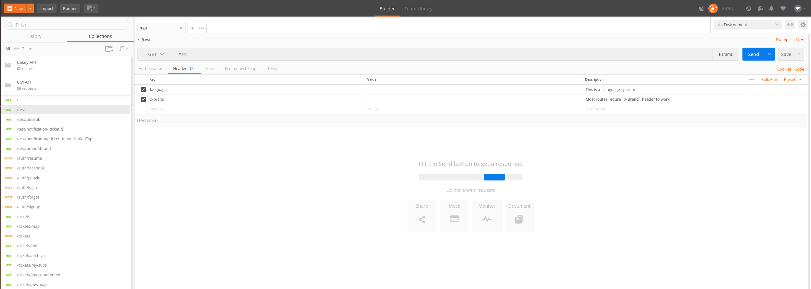
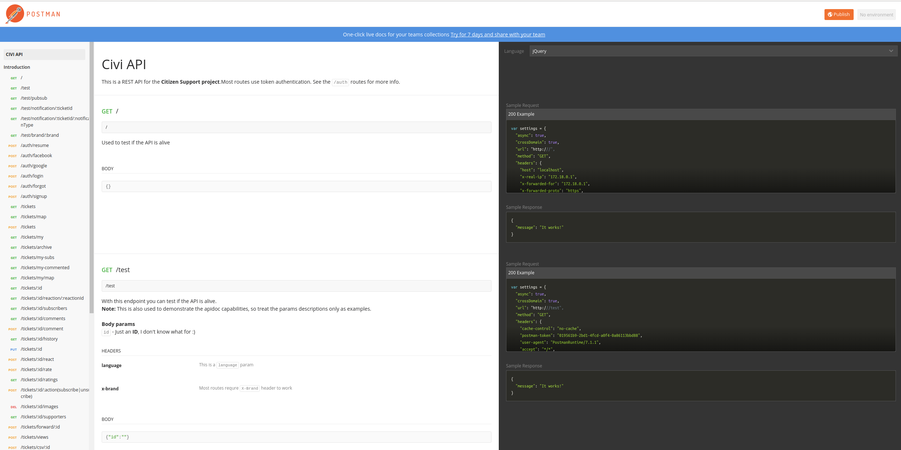

# Auto generated express documentation
This module is used for autogeneraton of API documentation in Node Express projects. The `generator` autoextracts all routes
from the express app so you will be sure all newly added routes are present in the apidoc.

**With it you can:**
 * generate API documentation as a single HTML page;
 * generate API documentation as a Postman importable JSON;
 * track request/response pairs to be used as examples in the apidoc;
 * write route metadata (documentation) next to the route definition, i.e. in-code.

### Generate apidoc documentation
**1. Get a template**

The `generate()` function uses the template generated by this project - [express-api-doc-template](https://github.com/forestlake/express-api-doc-template)

**2. Record some examples**

This is optional but recommended. See [Track examples](#to-track-requests-and-responses).

**3.1 Serve the apidoc as web page**

The apidoc is created on the fly, and you can serve it like this:
```javascript
const path = require('path');
const {ApiDocGenerator} = require('express-api-doc');

const config = {
    // Postman needs an id for the collection.
    // You can generate it on the fly or steal one from a dummy collection.
    postmanCollectionId: '3357681-bc1936ab-bc2b-c144-6b63-e8016f843b86',
    meta: {
        title: 'Our awesome API',
        description: `This is a REST API for the **XXX project**.
This is a general description of the API that **supports** \`markdown\``,
    },
    paths: {
        template: './public/apidoc/template.html',
        examples: './public/apidoc/examples.json',
    },
    // Routes to skip for tracking and apidoc generation
    skip: ['/apidoc', '/apidoc/postmanImport.json', '/bootstrap.min.css.map', '/favicon.ico', ],
    // This warning is displayed in the console when starting the express app
    trackerWarning: '\x1b[41mBEWARE\x1b[0m The request tracker is turned on! This is a dev only option!',
};

app.get('/apiDoc', (req, res, next) => {
        const apiDocGenerator = new ApiDocGenerator(app);
        res.send(apiDocGenerator.generate(config));
});
```

**3.2 Get a Postman importable JSON**

You can also get a JSON that can be imported into Postman. It represents a single
Postman collection and you can use the in app or web view to view the Apidoc.

**Note :** Postman supports `markdown` in the descriptions.

```javascript
const path = require('path');
const {ApiDocGenerator} = require('express-api-doc');

// Same as previous example
config = {...}

app.get('/apiDoc/postmanImport.json', (req, res, next) => {
    const apiDocGenerator = new ApiDocGenerator(app);

    res.set('Content-Type', 'application/json');
    res.send(apiDocGenerator.getJsonForPostmanImport(config));
});
```
To import into Postman click on `Import` => `Import From Link` => supply the full path `<host>/apiDoc/postmanImport.json`<br>

After import the collection can also be viewed in a web view<br>



### Write in-code documentation
The full potential of this apidoc is in the in code documentation support.
Use the `expressForApidoc()` constructor instead of the standard `express()`.<br>
**Note:** For now the template supports only `description`, `headerParams` and `bodyParams` in the metadata.<br>
**Note:** For this to work the metadata object has to be the last argument in the route definition. It will be added in the `app` object as `app.routesMeta[path][method] = metaObject`

```javascript
const {expressForApidoc} = require('express-api-doc');
...
const app = expressForApidoc();
...
app.get('/test', (req, res) => res.json({message: 'It works!'}), {
    description: `With this endpoint you can test if the API is alive.<br>
**Note:** This is also used to demonstrate the apidoc capabilities,
so treat the params descriptions only as examples.`,
    headerParams: {
        language: 'This is a `language` header param',
        token: 'Let\'s pretend we need some kind of **token** for this route',
    },
    bodyParams: {
        id: 'Just an **ID**, I don\'t know what for :)',
    },
});
```

### Track examples
Tracking is used solely to record req/res examples for each route. They are shown both in the apidoc generated with the `generator` and in `Postman`.
The `examples` path config has to be the same for the `generator` and `tracker`. My advice is to keep the config at a single location, e.g.:

```javascript
const {
    expressForApidoc,
    trackExamples,
} = require('express-api-doc');
const apiDocConfig = require('./routes/apiDoc').config;
const config = require('@config');

const app = expressForApidoc();

if (config.requestTrackerOn) {
    console.info(apiDocConfig.trackerWarning);
    trackExamples(app, apiDocConfig);
}

// Route and method definitions follow
...
```
**NB: For this to work enable example tracking before any route definitions in your app.**<br>

Using the `tracker` is especially convenient if you have coverage tests. To stop the tracking, just comment out the code or make it a config option.

### Example apidoc views
#### Singlepage apidoc - all routes

#### Singlepage apidoc - one route with examples

#### Postman apidoc - in the app

#### Postman apidoc - web view

